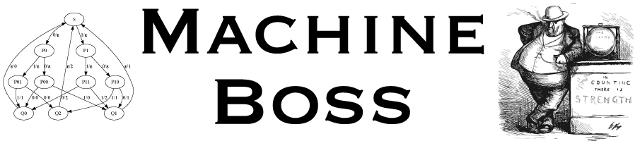

Many C++ HMM libraries for bioinformatics
focus on inference tasks, such as likelihood calculation, parameter-fitting, and alignment.
Machine Boss can do these things too, but it also introduces a set of operations for **manipulation** of the state machines themselves. The aim is to make it as easy to quick and easy to prototype automata-based tests in bioinformatics as it is to prototype regular expressions. (Often, this means building up the state machine using Unix one-liners.)

Manipulations can include concatenating, composing, intersecting, reverse complementing, Kleene-starring, and other such [operations](https://en.wikipedia.org/wiki/Finite-state_transducer).
Brief descriptions of these operations are included below.
Any state machine resulting from such operations can be run through the usual inference algorithms too (Forward, Backward, Viterbi, EM, beam search, prefix search, and so on).

For example, a protein-to-DNA alignment algorithm like [GeneWise](https://www.ncbi.nlm.nih.gov/pmc/articles/PMC479130/)
can be thought of as the combination of four state machines accounting for the following effects:

1. sequencing errors (e.g. substitutions)
2. splicing of introns
3. translation of DNA to protein
4. mutation of the protein (e.g. using the BLOSUM62 substitution matrix with affine gaps)

With Machine Boss, each layer in this hierarchy can be separately designed, parameter-fitted, and (if necessary) refactored. Want to turn a global alignment algorithm into a local one? Just flank the model with some wildcard-emitters. Developed a model for a high-accuracy sequencing technology, and now you want to use it with a noisier sequencer? Just bolt on a different error model. Looking for a Shine-Dalgarno sequence upstream of a signal peptide? No problem, just concatenate the models. And so on.

Machine Boss can read HMMER [profiles](http://hmmer.org/),
write GraphViz [dotfiles](https://www.graphviz.org/doc/info/lang.html), 
and run GeneWise-style [models](https://www.ncbi.nlm.nih.gov/pmc/articles/PMC479130/).
Its native format is a deliberately restricted (simple and validatable)
JSON representation of a [weighted finite-state transducer](https://en.wikipedia.org/wiki/Finite-state_transducer).

# Command-line interface

Machine Boss has an associated command-line tool, `boss`, that makes many machine-building operations available through its command-line options -
thereby defining a small expression language for building up automata.

A brief usage guide for this tool follows below.

## Examples

### Base-call the output of a neural network run on an Oxford Nanopore MinION read

The file [t/csv/nanopore_test.csv](t/csv/nanopore_test.csv)
was generated by [PoreOver](https://github.com/jordisr/poreover):

~~~~
boss --recognize-csv t/csv/nanopore_test.csv --beam-decode
~~~~

### Build a regex for an N-glycosylation binding site

PROSITE motif [PS00001](https://prosite.expasy.org/PS00001) has the pattern
`N-{P}-[ST]-{P}`.
The following command line saves a machine to `PS00001.json` that generates that motif
(the final `--eliminate` simply optimizes the state space):

~~~~
boss --generate-chars N \
 --concat --generate-one ACDEFGHIKLMNQRSTVWY \
 --concat --generate-one ST \
 --concat --generate-one ACDEFGHIKLMNQRSTVWY \
 --eliminate >PS00001.json
~~~~

### Search the N-glycosylation regex against the MinION read

This command takes the `PS00001.json` regex from the previous example,
runs it through a reverse-translation machine (`--preset translate`),
adds a self-loop with a dummy parameter (`--count-copies n`),
flanks it with a null model (`--generate-uniform-dna`),
and then uses the Forward-Backward algorithm to find the expected usage of the dummy parameter (`--counts`)

~~~~
boss --counts -v6 \
 --generate-uniform-dna \
 --concat \
  --begin \
   PS00001.json --preset translate --double-strand \
   --concat --generate-uniform-dna \
   --count-copies n \
  --end \
 --recognize-csv t/csv/nanopore_test.csv \
 --params data/Ecoli_codon.json
~~~~

Note that this takes quite a long time! The log messages reveal that the bulk of the time is being taken by sorting the states. This may be [optimized](https://github.com/evoldoers/machineboss/issues/94) in future.

### Encode binary data as non-repeating DNA

This example implements a DNA storage code very similar to that of [Goldman _et al_](https://www.ncbi.nlm.nih.gov/pmc/articles/PMC3672958/).

To encode we use beam search (`--beam-encode`).
We could also use prefix search, but beam search is generally much faster:

~~~~
boss --preset bintern --preset terndna --input-chars 1010101 --beam-encode
~~~~

Note that the encoder is a composite two-stage machine.
First it converts base-2 binary to base-3 ternary, using the preset machine `bintern`;
then it converts ternary to nonrepeating DNA, using the preset `terndna`.
We could have done this in two steps:

~~~~
boss --preset bintern --input-chars 1010101 --beam-encode
boss --preset terndna --input-chars 12022212 --beam-encode
~~~~

The first step yields the output sequence `12022212`; this is the input to the second step, which yields the output sequence `CGATATGC`.
That is the same output we get when we use the composite two-stage machine (`--preset bintern --preset terndna`).

To decode we can use beam search too:

~~~~
boss --preset bintern --preset terndna --output-chars CGATATGC --beam-decode
~~~~

## Manipulation of machines

### JSON format for specifying state machines

Formally, a machine is defined to be a [weighted finite-state transducer](https://en.wikipedia.org/wiki/Finite-state_transducer)
consisting of a tuple _(&Phi;,&Sigma;,&Gamma;,&omega;)_ where

- _&Phi;_ is an ordered finite set, the _state space_ (including _start_ and _end_ states);
- _&Sigma;_ is an ordered finite set, the _input alphabet_;
- _&Gamma;_ is an ordered finite set, the _output alphabet_;
- _&omega;(&alpha;,&beta;,&sigma;,&gamma;)_ is the _weight_ of a transition _&alpha; &rarr; &beta;_ that inputs _&sigma;_ and outputs _&gamma;_.

Using the [Forward algorithm](https://en.wikipedia.org/wiki/Forward_algorithm), one can calculate a _sequence weight_ _W(X,Y)_ for any input sequence _X_ and output sequence _Y_. In this sense, the transducer may be viewed as an infinite-dimensional matrix, indexed by sequences: _X_ is a row index, and _Y_ a column index.

Machine Boss uses a JSON format for transducers that also allows _&omega;_ to be constructed using algebraic functions of parameters (addition, multiplication, exponentiation, etc.) It further allows the specification of _constraints_ on the parameters, which are used during model-fitting.

### Special types of machine

| Term | Implication for _W(X,Y)_ |
|---|---|
| _Generator_ for set _S_ | Zero unless _X_ is the empty string and _Y_ is a member of _S_ (analogous to a row vector; if _S_ contains only one element whose weight is 1, then it's like a unit vector) |
| _Recognizer_ for set _S_ | Zero unless _X_ is a member of _S_ and _Y_ is the empty string (analogous to a column vector) |
| _Identity_ for set _S_ | Zero unless _X=Y_ and _X_ is a member of _S_ |

In general, "constraining the output of machine _M_ to be equal to _Y_" is equivalent to "composing _M_ with a unit-weight recognizer for _Y_".
Similarly, "constraining the input of _M_ to be equal to _X_" is equivalent to "composing a unit-weight generator for _X_ with _M_".

### Command-line syntax

The `boss` command does the following

- Construct a machine via a series of _machine expressions_ specified as command-line arguments
- Do any required inference with the machine (dynamic programming, decoding, etc.)

For example, the following command creates an recognizer for any DNA sequence containing the subsequence `ACGCGT`:

~~~~
boss --recognize-wild-dna --concat --recognize-chars ACGCGT --concat --recognize-wild-dna
~~~~

This is equivalent to the regular expression `/^[ACGT]*ACGCGT[ACGT]*$/`.

Some of the operations specified as command-line arguments can be replaced by "opcodes" comprising one or two characters.
For example, concatenation (`--concat`) can be abbreviated as a period, so that the above could be written as

~~~~
boss --recognize-wild-dna . --recognize-chars ACGCGT . --recognize-wild-dna
~~~~

If we use `--generate` instead of `--recognize`,
replace `wild-dna` (every nucleotide has unit weight) with `uniform-dna` (every nucleotide has weight 1/4),
specify an output sequence with `--output-chars`,
then instead of a regular expression we have a probabilistically-normalized HMM.
We can then specify the `--loglike` option to calculate the log-likelihood of a given output sequence:

~~~~
boss --generate-uniform-dna . --generate-chars ACGCGT . --generate-uniform-dna --output-chars AAGCAACGCGTAATA --loglike
~~~~

Compare this log-likelihood (-12.4766, or 18 bits) to the log-likelihood of the null model,
which does not specify that the output must contain the motif `ACGCGT`

~~~~
boss --generate-uniform-dna --output-chars AAGCAACGCGTAATA --loglike
~~~~

This log-likelihood (-20.7944, or 30 bits) differs from the previous one by 12 bits; reflecting the information content of the 6-base motif.

The opcodes are listed in full by the command-line help (`boss --help`).
Some of them may need to be quoted in order to prevent the Unix shell from interpreting them as special characters.
For example, `--begin` and `--end` can be abbreviated (respectively) as opening and closing parentheses, `(` and `)`,
but these must be quoted or they will be intercepted by the shell.

An argument that is not an opcode will be interpreted as the filename of a JSON-format machine file.

If more than one machine is specified without any explicit operation to combine them, then composition (matrix multiplication) is implicit.
So, for example, this

~~~~
boss --preset translate --compose --preset dna2rna
~~~~

is equivalent to this

~~~~
boss --preset translate --preset dna2rna
~~~~

### Ways of constructing machines

The first column of this table shows options to the `boss` command,
so e.g. the first example may be run by typing `boss --generate-one ACGT`

| Option | Description |
|---|---|
| `--generate-one ACGT` | A unit-weight generator for any _one_ of the specified characters (here `A`, `C`, `G` or `T`). Similar to a regex character class |
| `--generate-wild ACGT` | A unit-weight generator for any _string_ made up of the specified characters (here `A`, `C`, `G` or `T`, i.e. it will output any DNA sequence). Similar to a regex wildcard |
| `--generate-iid ACGT` | A generator for any string made up of the specified characters, with each character emission weighted (via parameters) to the respective character frequencies. Note that this is not a true probability distribution over output sequences, as no distribution is placed on the sequence length |
| `--generate-uniform ACGT` | A generator for any string made up of the specified characters, with each character emission weighted uniformly by (1/alphabet size). Note that this is not a true probability distribution over output sequences, as no distribution is placed on the sequence length |
| `--generate-uniform-dna`, etc. | Any of the above `--generate-XXX` forms may have `-dna`, `-rna` or `-aa` tacked on the end, in which case the alphabet does not need to be specified but is taken to be (respectively) `ACGT`, `ACGU` or `ACDEFGHIKLMNPQRSTVWY` |
| `--generate-chars AGATTC` | A unit-weight generator for the single string specified (which will be split into single-character symbols) |
| `--generate-fasta FILENAME.fasta` | A unit-weight generator for a sequence of characters read from a [FASTA-format](https://en.wikipedia.org/wiki/FASTA_format) file |
| `--generate-csv FILENAME.csv` | A generator corresponding to a [position-specific probability weight matrix](https://en.wikipedia.org/wiki/Position_weight_matrix) stored in a [CSV-format](https://en.wikipedia.org/wiki/Comma-separated_values) file, where the column titles in the first row correspond to output symbols (and a column with an empty title corresponds to gap characters in the weight matrix) |
| `--generate-json FILENAME.json` | A generator for a sequence of symbols read from a Machine Boss JSON file |
| `--hmmer HMMERFILE.hmm` | A generator corresponding to a [HMMer](http://hmmer.org/)-format profile HMM |

For each of the `--generate-XXX` options, the `--generate` can be replaced with `--recognize` to construct the corresponding recognizer, or (in most cases) with `--echo` for the identity.

### Preset machines

These example machines may be selected using the `--preset` keyword, e.g. `boss --preset null`

| Name | Description |
|---|---|
| `null` | Identity for the empty string |
| `compdna` | Complements DNA (but doesn't reverse it) |
| `comprna` | Complements RNA (but doesn't reverse it) |
| `translate` | A machine that inputs amino acids and outputs codons (yes, this should probably be called "reverse translate") |
| `prot2dna` | A [GeneWise](https://www.ncbi.nlm.nih.gov/pmc/articles/PMC479130/)-style model, finds a protein in DNA |
| `psw2dna` | Another [GeneWise](https://www.ncbi.nlm.nih.gov/pmc/articles/PMC479130/)-style model, allows substitutions & indels in the protein |
| `dnapsw` | A machine that implements [probabilistic Smith-Waterman](https://www.aaai.org/Papers/ISMB/1996/ISMB96-005.pdf) for DNA |
| `protpsw` | A machine that implements [probabilistic Smith-Waterman](https://www.aaai.org/Papers/ISMB/1996/ISMB96-005.pdf) for proteins |
| `bintern` | A machine that converts binary digits (in groups of 3) into ternary digits (in group of 2). To handle situations where the input isn't a multiple of 3 bits in length, the machine also outputs an escape code at the end, with any dangling bits converted to ternary |
| `terndna` | A machine that converts a ternary sequence into a non-repeating DNA sequence. Composed with the `bintern` preset, this can be used to implement the DNA storage code of [Goldman _et al_](https://www.ncbi.nlm.nih.gov/pmc/articles/PMC3672958/) |

### Operations transforming a single machine

| Operation | Command | Description | Analogy |
|---|---|---|---|
| Transpose | `boss m.json --transpose` | Swaps the inputs and outputs | Matrix transposition |
| Make optional (`?`) | `boss m.json --zero-or-one` | Zero or one tours through `m.json` | Union with the empty-string identity. Like the `?` in regexes |
| Form Kleene closure (`+`) | `boss m.json --kleene-plus` | One or more tours through `m.json` | Like the `+` in regexes |
| Form Kleene closure (`*`) | `boss m.json --kleene-star` | Zero or more tours through `m.json` | Like the `*` in regexes |
| Count copies | `boss m.json --count-copies x` | Like Kleene closure (`*`), but introducing a dummy unit-weight parameter (in this case, `x`) which can be used to find posterior-expected estimates of the number of tours of `m.json` in the path | |
| Take reciprocal | `boss m.json --reciprocal` | Take reciprocal of all transition weights | Pointwise reciprocal |
| Repeat | `boss m.json --repeat 3` | Repeat `m.json` the specified number of times | Fixed quantifiers in regexes |
| Reverse | `boss m.json --reverse` | Reverse the machine | |
| Reverse complement | `boss m.json --revcomp` | As you might expect | |
| Symmetrize forward & reverse strands | `boss m.json --double-strand` | Takes the union of a machine with its reverse complement | |
| Normalize | `boss m.json --joint-norm` | Normalize transition weights, so that sum of outgoing weights from each state is 1 | Probabilistic normalization |
| Sort | `boss m.json --sort` | Topologically sort the transition graph | |
| Eliminate redundant states | `boss m.json --eliminate` | Try to eliminate unnecessary states and transitions | |

### Operations combining two machines

| Operation | Command | Description | Analogy |
|---|---|---|---|
| Concatenate | `boss l.json --concat r.json` | Creates a combined machine that concatenates `l.json`'s input with `r.json`'s input, and similarly for their outputs | String concatenation |
| Compose |  `boss a.json --compose b.json` or `boss a.json b.json` | Creates a combined machine wherein every symbol output by `a.json` is processed as an input symbol of `b.json`. | Matrix multiplication |
| Intersect | `boss a.json --intersect b.json` | Creates a combined machine wherein every input symbol processed by `a.json` is also processed as an input symbol by `b.json` | Pointwise product |
| Take union | `boss a.json --union b.json` | Creates a combined machine consisting of `a.json` and `b.json` side-by-side; paths can go through one or the other, but not both | Pointwise sum |
| Make loop | `boss a.json --loop b.json` | Creates a combined machine that allows one `a`, followed by any number of `ba`'s | Kleene closure with spacer |

### Combining operations

The above operations may be combined to form complex expressions specifying automata from the command line. The `--begin` and `--end` options may be used (rather like left- and right-parentheses) to delimit sub-expressions.

For example, the following composes the `protpsw` and `translate` presets, and flanks this composite machine with uniform-DNA generators, thereby constructing a machine that can be used to search DNA (the output) for local ORFs homologous to a query protein (the input):

~~~~
boss --generate-uniform-dna \
 --concat --begin --preset protpsw --preset translate --end \
 --concat --generate-uniform-dna
~~~~

### JSON and C++ APIs

Most of the above operators for generating and manipulating machines are accessible directly via the C++ API, and can also be specified as JSON expressions within the model file.

### Model generation scripts

For when the presets aren't enough, there are scripts in the `js/` subdirectory that can generate some useful models.

## Application of machines

By default, the machine resulting from any manipulation operations is printed to standard output as a JSON file (or as a GraphViz dot file, if `--graphviz` was specified). However, there are several inference operations that can be performed on data instead.

### Specifying data

There are several ways to specify input and output sequences.

| Option | Description |
|---|---|
| `--input-chars AGATTA` | Specify the input as a sequence of characters directly from the command line |
| `--output-chars AGATTA` | Specify the output as a sequence of characters directly from the command line |
| `--input-fasta FILENAME.fasta` | Specify the input via a FASTA-format file |
| `--output-fasta FILENAME.fasta` | Specify the output via a FASTA-format file |
| `--data SEQPAIRS.json` | Specify pairs of input & output sequences via a JSON-format file |

### Dynamic programming algorithms

| Option | Description |
|---|---|
| `--loglike` | [Forward](https://en.wikipedia.org/wiki/Forward_algorithm) algorithm |
| `--train` | [Baum-Welch](https://en.wikipedia.org/wiki/Baum%E2%80%93Welch_algorithm) training, using generic optimizers from [GSL](https://www.gnu.org/software/gsl/) |
| `--align` | [Viterbi](https://en.wikipedia.org/wiki/Viterbi_algorithm) alignment |
| `--counts` | Calculates derivatives of the log-weight with respect to the logs of the parameters, a.k.a. the posterior expectations of the number of time each parameter is used |
| `--beam-decode` | Uses [beam search](https://en.wikipedia.org/wiki/Beam_search) to find the most likely input for a given output. Beam width can be specified using `--beam-width` |
| `--beam-encode` | Uses beam search to find the most likely output for a given input |
| `--codegen DIR` | Generate C++ or JavaScript code implementing the Forward algorithm |

## JSON schemas

Machine Boss defines [JSON schemas](schema/) for several data structures.
Here are some examples of files that fit these schemas:

- [transducer](https://github.com/evoldoers/machineboss/blob/master/t/machine/bitnoise.json). This file describes the [binary symmetric channel](https://en.wikipedia.org/wiki/Binary_symmetric_channel) from coding theory
    - [parameters](https://github.com/evoldoers/machineboss/blob/master/t/io/params.json)
    - [constraints](https://github.com/evoldoers/machineboss/blob/master/t/io/constraints.json) for model fitting. This file specifies the constraints `a+b=1` and `x+y+z=1`
        - see also [this file](https://github.com/evoldoers/machineboss/blob/master/t/io/pqcons.json) whose constraint `p+q=1` can be used to fit the binary symmetric channel, above
- [individual sequence](https://github.com/evoldoers/machineboss/blob/master/t/io/seqAGC.json) for constructing generators and recognizers
    - [list of sequence-pairs](https://github.com/evoldoers/machineboss/blob/master/t/io/seqpairlist.json) for model-fitting and alignment

## Help text

<pre><code>

General options:
  -h [ --help ]                 display this help message
  -v [ --verbose ] arg (=2)     verbosity level
  -d [ --debug ] arg            log specified function
  -b [ --monochrome ]           log in black & white

Transducer construction:
  -l [ --load ] arg             load machine from file
  -p [ --preset ] arg           select preset (null, compdna, comprna, dnapsw, 
                                protpsw, translate, prot2dna, psw2dna, dna2rna,
                                rna2dna, bintern, terndna, jukescantor)
  -g [ --generate-chars ] arg   generator for explicit character sequence '&lt;&lt;'
  --generate-one arg            generator for any one of specified characters
  --generate-wild arg           generator for Kleene closure over specified 
                                characters
  --generate-iid arg            as --generate-wild, but followed by 
                                --weight-output "p$"
  --generate-uniform arg        as --generate-iid, but weights outputs by 
                                1/(output alphabet size)
  --generate-fasta arg          generator for FASTA-format sequence
  --generate-csv arg            create generator from CSV file
  --generate-json arg           sequence generator for JSON-format sequence
  --generate-uniprot arg        create generator from UniProt ID (e.g. P12345)
  -a [ --recognize-chars ] arg  recognizer for explicit character sequence '&gt;&gt;'
  --recognize-one arg           recognizer for any one of specified characters
  --recognize-wild arg          recognizer for Kleene closure over specified 
                                characters
  --recognize-iid arg           as --recognize-wild, but followed by 
                                --weight-input "p$"
  --recognize-uniform arg       as --recognize-iid, but weights outputs by 
                                1/(input alphabet size)
  --recognize-fasta arg         recognizer for FASTA-format sequence
  --recognize-csv arg           create recognizer from CSV file
  --recognize-merge-csv arg     create recognizer from CSV file, merging 
                                consecutively repeated characters as in Graves 
                                (2006) 'Connectionist Temporal Classification'
  --recognize-json arg          sequence recognizer for JSON-format sequence
  --echo-one arg                identity for any one of specified characters
  --echo-wild arg               identity for Kleene closure over specified 
                                characters
  --echo-chars arg              identity for explicit character sequence
  --echo-fasta arg              identity for FASTA-format sequence
  --echo-json arg               identity for JSON-format sequence
  -w [ --weight ] arg           weighted null transition '#'
  -H [ --hmmer ] arg            create generator from HMMER3 model file
  --pfam arg                    create generator from PFAM ID (e.g. Piwi)
  --dfam arg                    create generator from DFAM ID (e.g. DF0004136)

Postfix operators:
  -z [ --zero-or-one ]          union with null '?'
  -k [ --kleene-star ]          Kleene star '*'
  -K [ --kleene-plus ]          Kleene plus '+'
  --count-copies arg            Kleene star with dummy counting parameter
  --repeat arg                  repeat N times
  -e [ --reverse ]              reverse
  -r [ --revcomp ]              reverse-complement '~'
  --flank-input-wild            add flanking delete states: partially match 
                                input
  --flank-output-wild           add flanking insert states: partially match 
                                output
  --flank-either-wild           add flanking insert or delete states: partially
                                match either input or output at each end
  --flank-both-wild             add flanking insert & delete states: partially 
                                match input and/or output
  --flank-input-geom arg        like --flank-input-wild, but flanking input 
                                sequence is uniform IID with 
                                geometrically-distributed length, parameterized
                                using specified expression
  --flank-output-geom arg       like --flank-output-wild, but flanking output 
                                sequence is uniform IID with 
                                geometrically-distributed length, parameterized
                                using specified expression
  --double-strand               union of machine with its reverse complement
  -t [ --transpose ]            transpose: swap input/output
  --downsample-size arg         keep only specified proportion of transitions, 
                                discarding those with lowest posterior 
                                probability
  --downsample-prob arg         keep only transitions above specified posterior
                                probability threshold
  --downsample-path arg         stochastically sample specified number of 
                                paths, discard unsampled transitions
  --downsample-frac arg         sample paths until specified fraction of 
                                transitions covered
  --joint-norm                  normalize jointly (outgoing transition weights 
                                sum to 1)
  --cond-norm                   normalize conditionally (outgoing transition 
                                weights for each input symbol sum to 1)
  --sort                        topologically sort, eliminating silent cycles
  --sort-fast                   topologically sort, breaking silent cycles 
                                (faster than --sort, but destructive)
  --sort-cyclic                 topologically sort if possible, but preserve 
                                silent cycles
  --decode-sort                 topologically sort non-outputting transition 
                                graph
  --encode-sort                 topologically sort non-inputting transition 
                                graph
  --full-sort                   topologically sort entire transition graph, not
                                just silent transitions
  -n [ --eliminate ]            eliminate all silent transitions
  --eliminate-states            eliminate all states whose only outgoing 
                                transition is silent
  --strip-names                 remove all state names. Some algorithms (e.g. 
                                composition of large transducers) are faster if
                                states are unnamed
  --pad                         pad with "dummy" start & end states
  --reciprocal                  element-wise reciprocal: invert all weight 
                                expressions
  --weight-input arg            multiply input weights by specified JSON 
                                expression ($ expands to input symbol, # to 
                                input alphabet size)
  --weight-output arg           multiply output weights by specified JSON 
                                expression ($ expands to output symbol, # to 
                                output alphabet size)
  --weight-input-geom arg       place geometric distribution with specified 
                                parameter over input length
  --weight-output-geom arg      place geometric distribution with specified 
                                parameter over output length

Infix operators:
  -m [ --compose ]              compose, summing out silent cycles '=&gt;'
  --compose-fast                compose, breaking silent cycles (faster, 
                                destructive)
  --compose-cyclic              compose, leaving silent cycles
  -c [ --concatenate ]          concatenate '.'
  -i [ --intersect ]            intersect, summing out silent cycles '&&'
  --intersect-fast              intersect, breaking silent cycles (faster, 
                                destructive)
  --intersect-cyclic            intersect, leaving silent cycles
  -u [ --union ]                union '||'
  -o [ --loop ]                 loop: x '?+' y = x(y.x)*

Miscellaneous:
  -B [ --begin ]                left bracket '('
  -E [ --end ]                  right bracket ')'

Transducer application:
  -S [ --save ] arg             save machine to file
  -G [ --graphviz ]             write machine in Graphviz DOT format
  --evaluate                    evaluate all transition weights in final 
                                machine
  --define-exprs                define and re-use repeated (sub)expressions, 
                                for compactness
  --show-params                 show unbound parameters in final machine
  -U [ --use-defaults ]         use defaults (uniform distributions, unit 
                                rates) for unbound parameters; this option is 
                                implicit when training
  --name-states                 use state id, rather than number, to identify 
                                transition destinations
  -P [ --params ] arg           load parameters (JSON)
  -F [ --functions ] arg        load functions & constants (JSON)
  -N [ --constraints ] arg      load normalization constraints (JSON)
  -D [ --data ] arg             load sequence-pairs (JSON)
  -I [ --input-fasta ] arg      load input sequence(s) from FASTA file
  --input-json arg              load input sequence from JSON file
  --input-chars arg             specify input character sequence explicitly
  --input-uniprot arg           specify input sequence by UniProt ID (e.g. 
                                P12345)
  -O [ --output-fasta ] arg     load output sequence(s) from FASTA file
  --output-json arg             load output sequence from JSON file
  --output-chars arg            specify output character sequence explicitly
  --output-uniprot arg          specify output sequence by UniProt ID (e.g. 
                                P12345)
  -T [ --train ]                Baum-Welch parameter fit
  -R [ --wiggle-room ] arg      wiggle room (allowed departure from training 
                                alignment)
  -A [ --align ]                Viterbi sequence alignment
  -L [ --loglike ]              Forward log-likelihood calculation
  -C [ --counts ]               Forward-Backward counts (derivatives of 
                                log-likelihood with respect to logs of 
                                parameters)
  -Z [ --beam-decode ]          find most likely input by beam search
  --beam-width arg              number of sequences to track during beam search
                                (default 100)
  --prefix-decode               find most likely input by CTC prefix search
  --prefix-backtrack arg        specify max backtracking length for CTC prefix 
                                search
  --cool-decode                 find most likely input by simulated annealing
  --mcmc-decode                 find most likely input by MCMC search
  --decode-steps arg            simulated annealing steps per initial symbol
  -Y [ --beam-encode ]          find most likely output by beam search
  --prefix-encode               find most likely output by CTC prefix search
  --random-encode               sample random output by stochastic prefix 
                                search
  --seed arg                    random number seed

Parser-generator:
  --codegen arg                 generate parser code, save to specified 
                                directory
  --cpp64                       generate C++ dynamic programming code (64-bit)
  --cpp32                       generate C++ dynamic programming code (32-bit)
  --js                          generate JavaScript dynamic programming code
  --showcells                   include debugging output in generated code
  --inseq arg                   input sequence type (String, Intvec, Profile)
  --outseq arg                  output sequence type (String, Intvec, Profile)

</code></pre>
