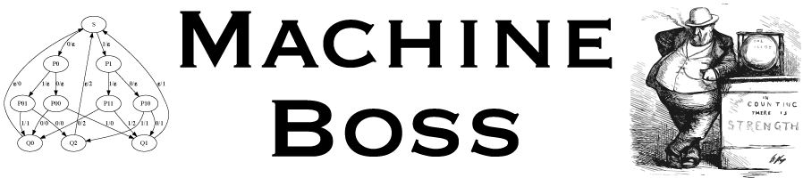

[](https://github.com/evoldoers/machineboss/actions/workflows/ci.yml) [](https://github.com/evoldoers/machineboss/blob/master/LICENSE) [](https://github.com/evoldoers/machineboss/tree/master/python/)

Many HMM libraries for bioinformatics
focus on inference tasks, such as likelihood calculation, parameter-fitting, and alignment.
Machine Boss can do these things too: on CPUs, on GPUs, on the web, or differentiably. It also goes beyond inference to abstract construction, introducing a set of operations for **manipulation** of the state machines themselves. The aim is to make it as quick and easy to prototype automata-based experiments in bioinformatics as it is to prototype regular expressions.
(Machine Boss does, in fact, support regular expression syntax---along with many other file formats and patterns.)

Machine Boss allows you to manipulate state machines
by concatenating, composing, intersecting, reverse complementing, Kleene-starring, and other such [operations](https://en.wikipedia.org/wiki/Finite-state_transducer).
Any state machine resulting from such operations can be run through the usual inference algorithms too (Forward, Backward, Viterbi, EM, beam search, prefix search, and so on).

Machine Boss is multilingual: algorithms are available in C++, Python/JAX, JavaScript, and WGSL (WebGPU).
The [Python/JAX package](/python/) provides differentiable inference and training algorithms,
supporting HMM decoding heads and neural transducers for integration with deep learning frameworks.
The [WebGPU/JavaScript library](/webgpu/) enables GPU-accelerated inference directly in the browser,
with a pure JavaScript CPU fallback for environments without WebGPU support.

## Documentation

- **[Tutorial](/tutorial/)** --- walk through the "occasionally dishonest casino" example, building generators, transducers, and compositions
- **[Program Reference](/machineboss/)** --- full command-line reference for the `boss` tool
- **[JSON Format Reference](/json-format/)** --- documentation for the Machine Boss JSON transducer format and related schemas
- **[Expression Language](/expressions/)** --- the weight expression mini-language
- **[JSON Output Formats](/json-output/)** --- documentation for all JSON output formats
- **[Composition Algorithm](/composition/)** --- detailed description of the transducer composition algorithm
- **[WebGPU API](/webgpu/)** --- GPU-accelerated inference in the browser via WebGPU with JavaScript CPU fallback
- **[Python/JAX API](/python/)** --- differentiable dynamic programming with JAX
- **[Presets Reference](/presets/)** --- built-in preset transducers
- **[C++ Library API](/library-api/)** --- convenience functions for embedding Machine Boss

### Tutorials

- **[Biological Sequence Analysis](/bio-tutorial/)** --- protein motifs, profile HMMs, evolutionary models
- **[GeneWise-style Fused DP](/genewise/)** --- protein-to-DNA alignment with fused JAX kernels
- **[DNA Data Storage](/dna-storage/)** --- encoding binary data as constrained DNA sequences
- **[A Brief History of Transducers](/transducer-history/)** --- from Turing to GeneWise to Machine Boss

## Installation

Machine Boss can be compiled from C++ source:

```bash
brew install gsl boost htslib pkgconfig   # macOS deps
make                                       # builds bin/boss
npm install                                # needed for tests
make test                                  # runs full test suite
```

For full installation instructions see [INSTALL.md](https://github.com/evoldoers/machineboss/blob/master/INSTALL.md).

## Citation

Silvestre-Ryan, Wang, Sharma, Lin, Shen, Dider, and Holmes. Bioinformatics (2020).
[Machine Boss: Rapid Prototyping of Bioinformatic Automata.](https://pubmed.ncbi.nlm.nih.gov/32683444/)
